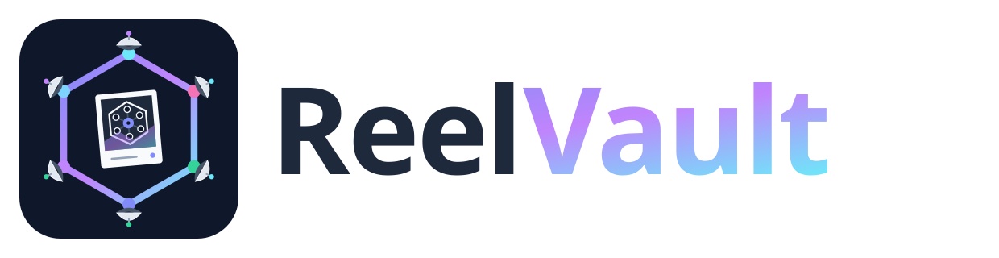
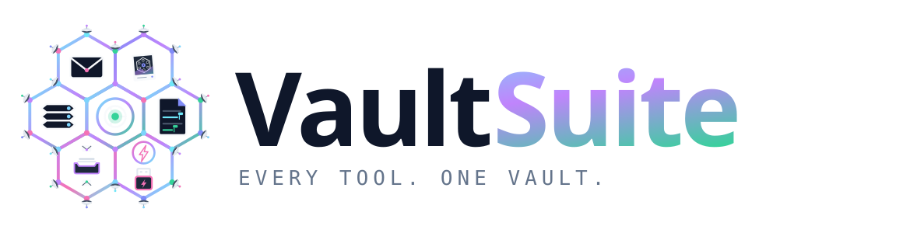

  <picture>
    <source media="(prefers-color-scheme: dark)" srcset="reelvault-lockup-reversed.svg">
    
  </picture>

<b>Your moments, kept on your own devices.</b>

# ReelVault — releases

Public download mirror for **ReelVault**, a cross-platform, user-owned photo &
video gallery built on Holochain. Your photos live on **your** devices — no
cloud, no telemetry, no lock-in.

The application source is maintained privately; this repository publishes the
distributable release artifacts (desktop installers, the Android APK, the
`reelvault.happ` bundle, and the Vault Node manifest).

## Download

Grab the latest installer for your platform from the
[**Releases**](https://github.com/markCCGnomes/reelvault-releases/releases/latest) page:

| Platform | File |
|---|---|
| Windows | `ReelVault_<version>_x64_en-US.msi` or `ReelVault_<version>_x64-setup.exe` |
| macOS | `ReelVault_<version>_universal.dmg` |
| Linux | `ReelVault_<version>_amd64.AppImage` or `ReelVault_<version>_amd64.deb` |
| Android | `ReelVault_<version>_universal-release.apk` |

`reelvault.happ` + `vault-node.manifest.json` are for self-hosting on a Vault Node.

## Free & Plus

The **entire gallery is free** — import, organize (albums, tags, dates, map),
People/face grouping, editing, sharing albums, local & peer-to-peer storage, and
full export are always yours at no cost. **ReelVault Plus** adds the Documents &
Drive companion apps and community-hosted backup. One app, one network — Plus is
a client-side unlock and never changes how your data is stored.

## License

Distributed under the **Vault Ecosystem License v1.1** (see [`LICENSE`](LICENSE)):
free to download, use, and self-host — personal and commercial — with no
redistribution, modification, reverse engineering, or hosted-service resale.

---

  <picture>
    <source media="(prefers-color-scheme: dark)" srcset="vaultsuite-lockup-reversed.svg">
    
  </picture>

ReelVault is part of the <b>VaultSuite</b> family — user-owned apps on your own devices.

